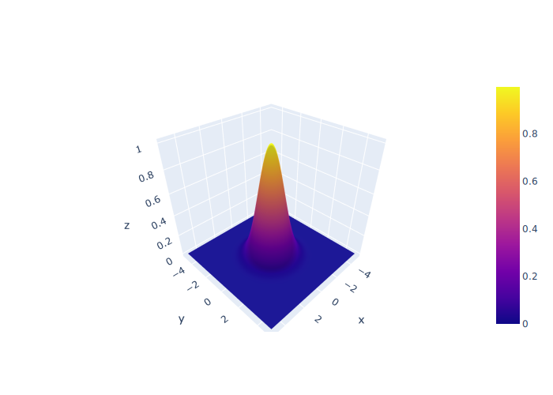
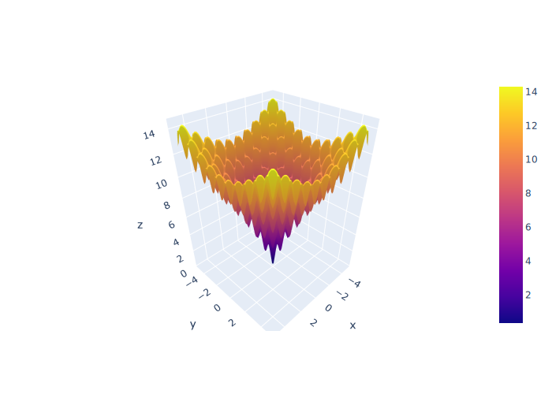
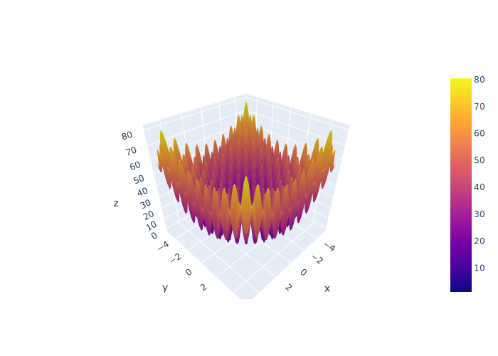
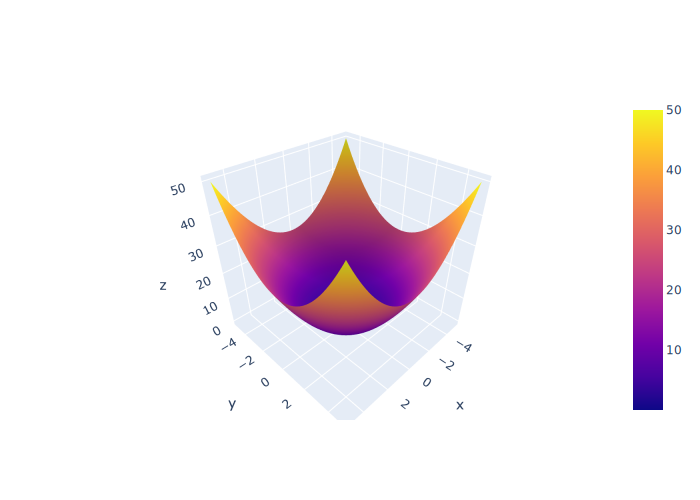
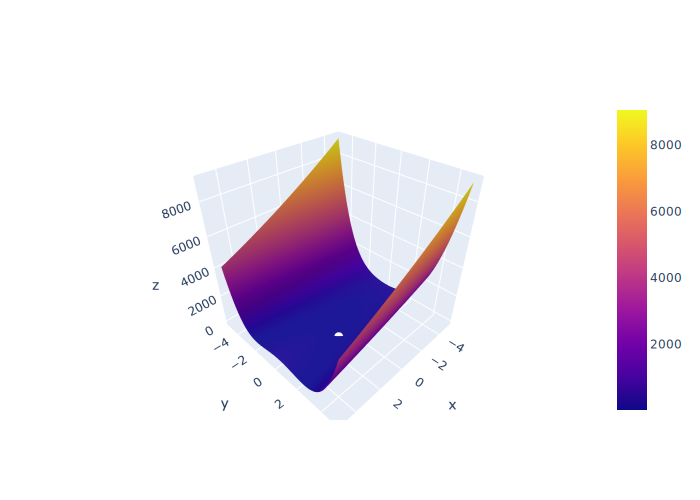
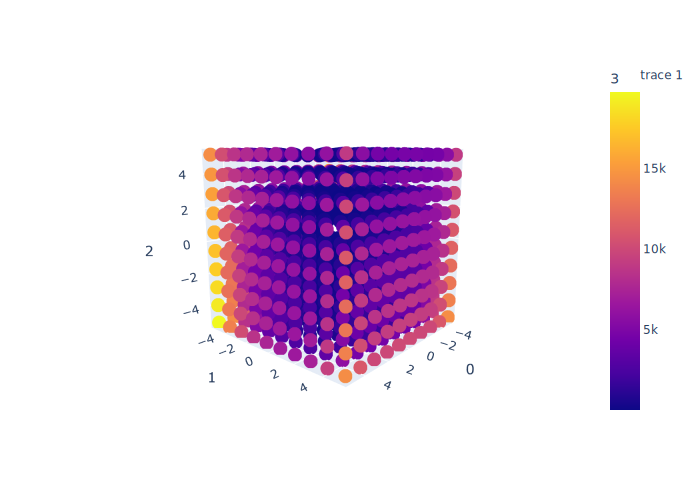

# Problems

----
----

This directory contains collection of classic and non-classical test problems for optimization.

----

# gaussian

|key | value|
|---|---|
|name | gaussian| 
|func | <function nd_gaussian at 0x0000014126BF9990>| 
|type_ | OptimizationType.MAX| 
|global_goal | <function goal at 0x0000014126BF9CF0>| 
|range_ | (-5, 5)| 
|local_min | 0| 
|num_dim | (1, inf)| 
|convex | True| 
|roughness | 0| 
|symmetric | True| 

    n-dimensional Gaussian function

    Features:
    --------
    * smooth optimization
    * single minima at [0,0,..,1]

    Parameters
    ----------
    args: array
        [x[:], y[:], z[:], ...] or np.ndarray[:,:,:] (first index determines dimensionality)
        the number of values determines dimensionality
    sigma: float, list[float]
        standard deviation
    pre_factor: float
        pre-factor
    center: float, list[float]
        center of distribution

    Returns
    -------
    return: np.ndarray
        z value

    

----

# ackley

|key | value|
|---|---|
|name | ackley| 
|func | <function ackley at 0x0000014126BF9EA0>| 
|type_ | OptimizationType.MIN| 
|global_goal | <function goal at 0x0000014126BFA050>| 
|range_ | (-5, 5)| 
|local_min | 100| 
|num_dim | (1, inf)| 
|convex | False| 
|roughness | 5| 
|symmetric | True| 

    Ackley function

    References
    ----------
    Ackley, D. H. (1987) "A connectionist machine for genetic hillclimbing", Kluwer Academic Publishers, Boston MA.

    Features:
    --------
    * slightly rough, but mostly smooth optimization
    * single minima at center
    * typical x range [-5, 5]

    Parameters
    ----------
    args: array
        [x[:], y[:], z[:], ...] or np.ndarray[:,:,:] (first index determines dimensionality)
        the number of values determines dimensionality

    Returns
    -------
    return: np.ndarray
        z value

    

----

# rastrigin

|key | value|
|---|---|
|name | rastrigin| 
|func | <function rastrigin at 0x0000014126BFA3B0>| 
|type_ | OptimizationType.MIN| 
|global_goal | <function goal at 0x0000014126BFA440>| 
|range_ | (-5.12, 5.12)| 
|local_min | 100| 
|num_dim | (1, inf)| 
|convex | False| 
|roughness | 7| 
|symmetric | True| 

    Rastrigin function

    Features
    -------
    * non-convex function
    * non-linear multimodal function
    * large number of local minima
    * global minima is at zero
    * typical x range [-5.12, 5.12]

    Parameters
    ----------
    args: array
        [x[:], y[:], z[:], ...] or np.ndarray[:,:] (second index determines dimensionality)
        the number of values determines dimensionality
    constant: float

    Returns
    -------
    return: np.ndarray
        z value

    

----

# sphere

|key | value|
|---|---|
|name | sphere| 
|func | <function sphere at 0x0000014126BFA7A0>| 
|type_ | OptimizationType.MIN| 
|global_goal | <function goal at 0x0000014126BFA830>| 
|range_ | (-5, 5)| 
|local_min | 0| 
|num_dim | (1, inf)| 
|convex | True| 
|roughness | 0| 
|symmetric | True| 

    Sphere function

    References
    ----------

    Features:
    --------
    *  smooth optimization
    * single minima at center
    * typical x range [-5, 5]

    Parameters
    ----------
    args: array
        [x[:], y[:], z[:], ...]
        the number of values determines dimensionality

    Returns
    -------
    return: np.ndarray
        z value

    

----

# rosenbrock

|key | value|
|---|---|
|name | rosenbrock| 
|func | <function rosenbrock at 0x0000014126BFAB90>| 
|type_ | OptimizationType.MIN| 
|global_goal | <function goal at 0x0000014126BFAC20>| 
|range_ | (-5, 5)| 
|local_min | 100| 
|num_dim | (2, inf)| 
|convex | False| 
|roughness | 0| 
|symmetric | False| 

    Rosenbrock function

    Features
    -------
    * non-convex function
    * one of minima
    * global minima is at 1
    * typical x range [-5, 5]

    Parameters
    ----------
    args: array
        [x[:], y[:], z[:], ...] or np.ndarray[:,:] (second index determines dimensionality)
        the number of values determines dimensionality
    constant: float
        constant

    Returns
    -------
    return: np.ndarray
        z value

    

----

# rosenbrock_variant

|key | value|
|---|---|
|name | rosenbrock_variant| 
|func | <function rosenbrock_variant at 0x0000014126BFADD0>| 
|type_ | OptimizationType.MIN| 
|global_goal | <function goal at 0x0000014126BFAE60>| 
|range_ | (-5, 5)| 
|local_min | 1| 
|num_dim | (3, 7)| 
|convex | False| 
|roughness | 0| 
|symmetric | False| 

    Rosenbrock function - variant

    Features
    -------
    * non-convex function
    * one of local minima as [-1,1,1,...]
    * global minima is at 1
    * typical x range [-5, 5]

    Parameters
    ----------
    args: array
        [x[:], y[:], z[:], ...] or np.ndarray[:,:] (second index determines dimensionality)
        the number of values determines dimensionality
    constant: float
        constant

    Returns
    -------
    return: np.ndarray
        z value

    

----

